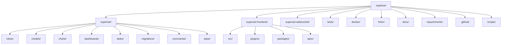
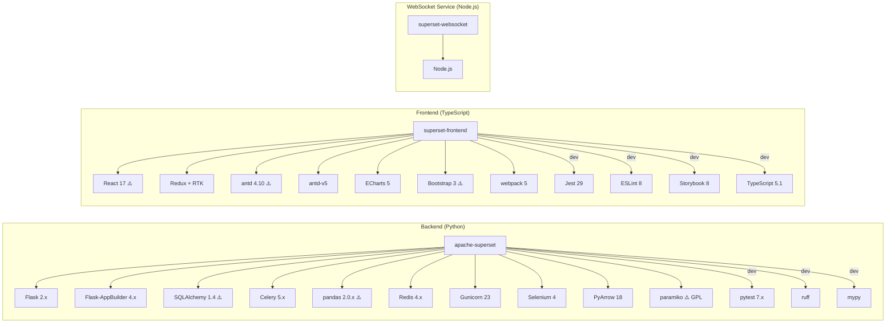
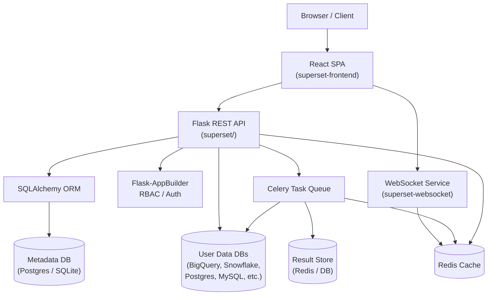
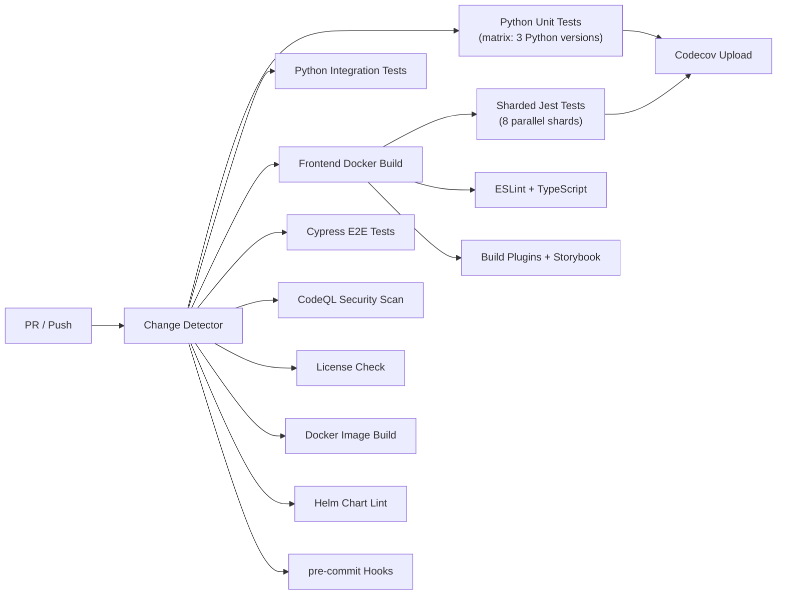

# Repository Analysis: snsinahub-org/superset

**Analysis Date:** 2026-04-01  
**Repository:** [snsinahub-org/superset](https://github.com/snsinahub-org/superset)  
**Based on:** Apache Superset — a modern, enterprise-ready business intelligence web application.

> **Note:** This file was created at `docs/docs/repo-analysis.md` because the `reports/` directory could not be automatically created in this environment. To move it: `mkdir -p reports && mv docs/docs/repo-analysis.md reports/repo-analysis.md`.

---

## 1. Repository Structure

The repository is a **monorepo** hosting the full Superset platform across multiple sub-projects:

| Directory / File | Description |
|---|---|
| `superset/` | Python/Flask backend application |
| `superset-frontend/` | React/TypeScript frontend (webpack, lerna workspaces) |
| `superset-websocket/` | Standalone Node.js WebSocket service |
| `tests/` | Python tests (unit + integration) |
| `docker/` | Docker bootstrap and entry-point scripts |
| `helm/` | Kubernetes Helm chart |
| `docs/` | Documentation sources (Docusaurus) |
| `requirements/` | Python pinned dependency files (uv-generated) |
| `.github/` | GitHub Actions workflows, issue templates, CODEOWNERS |
| `scripts/` | Build and release helper scripts |



---

## 2. Primary Languages & Frameworks

| Layer | Language | Primary Framework |
|---|---|---|
| Backend | Python 3.10–3.12 | Flask + Flask-AppBuilder |
| Frontend | TypeScript / JavaScript | React 17 + Redux + webpack 5 |
| WebSocket | TypeScript | Node.js / ws |
| Infrastructure | YAML / Dockerfile | Docker / Helm / GitHub Actions |
| Documentation | TypeScript + MDX | Docusaurus |

---

## 3. Dependency Analysis

### 3.1 Python (Backend)

**Dependency manager:** `uv` — lock files auto-generated from `pyproject.toml` and `requirements/*.in`.  
**Lock file present:** ✅ `requirements/base.txt`, `requirements/development.txt`

#### Key Direct Runtime Dependencies

| Package | Version Constraint | Purpose |
|---|---|---|
| Flask | `>=2.2.5, <3.0.0` | Web framework |
| Flask-AppBuilder | `>=4.7.0, <5.0.0` | Admin UI / RBAC framework |
| SQLAlchemy | `>=1.4, <2` | ORM (⚠️ pinned to legacy 1.x) |
| Celery | `>=5.3.6, <6.0.0` | Async task queue |
| pandas | `>=2.0.3, <2.1` | Data manipulation (⚠️ tight upper bound) |
| numpy | `>1.23.5, <2.3` | Numerical computing |
| Redis | `>=4.6.0, <5.0` | Cache / message broker |
| Gunicorn | `>=22.0.0` | WSGI server |
| PyJWT | `>=2.4.0, <3.0` | JWT authentication |
| cryptography | `>=42.0.4, <45.0.0` | Encryption |
| paramiko | `>=3.4.0` | SSH tunneling (⚠️ GPL-flagged) |
| pyxlsb | transitive via pandas | Excel reading (⚠️ GPL-flagged) |
| selenium | `>=4.14.0, <5.0` | Screenshot/thumbnail rendering |
| pyarrow | `>=18.1.0, <19` | Arrow data interchange |
| sqlglot | `>=26.1.3, <27` | SQL parsing/transpilation |

#### Key Development / Test Dependencies

| Package | Version | Purpose |
|---|---|---|
| pytest | `<8.0.0` | Testing (pinned away from 8.x) |
| pytest-cov | latest | Coverage |
| ruff | latest | Linter / formatter |
| pre-commit | `4.1.0` | Pre-commit hooks |
| freezegun | latest | Time mocking in tests |
| mypy | via pyproject.toml | Static type checking |

### 3.2 JavaScript/TypeScript (Frontend)

**Dependency manager:** npm with **lerna** workspaces.  
**Lock file present:** ✅ `superset-frontend/package-lock.json`  
**Node.js requirement:** `^20.16.0`  
**npm requirement:** `^10.8.1`

#### Key Runtime Dependencies

| Package | Version | Notes |
|---|---|---|
| React | `^17.0.2` | ⚠️ React 18/19 available |
| Redux + Redux Toolkit | `^4.2.1` / `^1.9.3` | State management |
| antd | `4.10.3` | Ant Design v4 (migration in-progress) |
| antd-v5 | `npm:antd@^5.18.0` | Ant Design v5 (migration in-progress) |
| echarts | `^5.6.0` | Charting library |
| ag-grid-community | `33.1.1` | Enterprise-grade data grid |
| mapbox-gl | `^2.10.0` | Maps |
| react-router-dom | `^5.3.4` | Routing (⚠️ v6/v7 available) |
| bootstrap | `^3.4.1` | CSS framework (⚠️ EOL, v3) |
| jQuery | `^3.7.1` | DOM manipulation (legacy) |
| lodash | `^4.17.21` | Utility library |
| dompurify | `^3.2.4` | XSS sanitization ✅ |
| TypeScript | `5.1.6` | Type-safe JavaScript |

#### Key Dev Dependencies

| Package | Version | Purpose |
|---|---|---|
| webpack | `^5.98.0` | Bundler |
| Jest | `^29.7.0` | Unit testing |
| ESLint | `^8.56.0` | Linter |
| Storybook | `8.1.11` | Component explorer |
| Cypress (E2E) | via `@cypress/react` | End-to-end tests |
| Prettier | `3.5.3` | Code formatter |
| Babel | `^7.x` | Transpiler |
| Lerna | `^8.2.1` | Monorepo package management |

---

## 4. Dependency Graph



---

## 5. Architecture

Apache Superset follows a **modular monolith** pattern for the backend, combined with a separate **React SPA frontend** and a dedicated **WebSocket microservice**.



**Key architectural patterns:**
- **Command pattern** (`superset/commands/`) — dedicated command objects encapsulate business logic operations.
- **DAO pattern** (`superset/daos/`) — data access objects abstract ORM calls for each domain entity.
- **Plugin system** — frontend chart plugins in `superset-frontend/plugins/`, backend DB engine specs in `superset/db_engine_specs/`.
- **FAB (Flask-AppBuilder)** — provides RBAC, authentication, REST API scaffolding, and admin views.
- **Celery + Redis** — async task execution for long-running queries, alerts, and thumbnail generation.
- **Embedded SDK** — `superset-embedded-sdk` for embedding dashboards in third-party applications.

---

## 6. Testing Frameworks

| Layer | Framework | Test Location |
|---|---|---|
| Python unit tests | pytest | `tests/unit_tests/` |
| Python integration tests | pytest | `tests/integration_tests/` |
| Frontend unit tests | Jest + React Testing Library | `superset-frontend/spec/` |
| Frontend E2E tests | Cypress | `superset-frontend/cypress-base/` |
| Visual regression | Applitools Eyes | via CI workflows |
| WebSocket unit tests | Jest | `superset-websocket/spec/` |

---

## 7. CI/CD Configuration

GitHub Actions with **40+ workflow files** covering all quality gates:



Notable CI/CD features:
- **Concurrency cancellation** — previous runs cancelled on PR updates.
- **Change detection** — skips irrelevant jobs when no matching files changed.
- **Matrix Python testing** — `previous`, `current`, `next` Python versions.
- **Sharded Jest tests** — 8 parallel shards for faster frontend test execution.
- **Dependabot** enabled (`.github/dependabot.yml`).
- **pre-commit** hooks configured (`.pre-commit-config.yaml`) with ruff, mypy, etc.
- **FOSSA** integration for license compliance reporting.
- **CodeQL** for static security analysis.

---

## 8. Findings & Recommendations

### Finding 1 — SQLAlchemy Pinned to Legacy 1.4

**Category:** Dependency | **Priority:** High

`pyproject.toml` pins `sqlalchemy>=1.4, <2`. SQLAlchemy 2.0 was released in January 2023 and SQLAlchemy 2.1 followed. Staying on 1.4 (EOL) means missing two major releases worth of security patches, performance improvements, and the new 2.0 query API. The entire ORM layer would need to be updated to migrate.

---

### Finding 2 — GPL-Licensed Dependencies in an Apache 2.0 Project

**Category:** Security / Legal | **Priority:** High

`pyproject.toml` contains explicit TODO comments flagging two GPL-licensed packages:
```
# TODO REMOVE THESE DEPS FROM CODEBASE
paramiko = "3"  # GPL
pyxlsb = "1"   # GPL
```
`paramiko` (SSH tunneling) and `pyxlsb` (Excel file reading, transitive via pandas) carry GPL licenses. Including GPL code in an Apache 2.0 distributed project creates legal and licensing conflicts that must be resolved before official ASF releases.

---

### Finding 3 — React 17 — Two Major Versions Behind

**Category:** Dependency | **Priority:** Medium

The frontend uses React `^17.0.2`. React 18 (April 2022) introduced concurrent rendering, automatic batching, `useTransition`, and `useDeferredValue`. React 19 (December 2024) added Server Components and Actions. Running on React 17 means missing significant performance improvements and two release cycles of security patches. React 17 is no longer receiving updates.

---

### Finding 4 — Bootstrap 3 Still in Production Frontend

**Category:** Dependency | **Priority:** Medium

`bootstrap@^3.4.1` is in active use. Bootstrap 3 has been end-of-life since 2019. It carries outdated CSS patterns, accessibility issues (pre-WCAG 2.1 era), and a large unoptimized CSS footprint. Bootstrap 5 (current) is a fully rewritten version.

---

### Finding 5 — pandas Upper-Bound Too Tight (`<2.1`)

**Category:** Dependency | **Priority:** Medium

`pandas>=2.0.3, <2.1` prevents any pandas 2.1+ patches or security fixes from being applied. pandas 2.1 through 2.2 include important bug fixes and performance improvements. The constraint unnecessarily limits the ability to pick up security updates without a code change. pandas 3.0 is now available.

---

### Finding 6 — Dual Ant Design Versions (v4 + v5 Coexistence)

**Category:** Architecture | **Priority:** Medium

Both `antd@4.10.3` and `antd-v5: npm:antd@^5.18.0` are listed as production dependencies, indicating an in-progress, partially-completed migration from Ant Design v4 to v5. This doubles the Ant Design bundle weight (~1-2 MB extra), can cause style inconsistencies between old and new components, and creates confusion for contributors. The migration should be completed and antd v4 removed.

---

### Finding 7 — React Router v5 — One Major Version Behind

**Category:** Dependency | **Priority:** Low

`react-router-dom@^5.3.4` is used. React Router v6 (2021) introduced a completely redesigned, hooks-based API with better code splitting and tree shaking. React Router v7 (2024) further improved the developer experience. v5 is no longer actively maintained.

---

### Finding 8 — pytest Pinned Away from Version 8

**Category:** Testing | **Priority:** Low

`pytest<8.0.0` with the inline comment:
```python
# hairy issue with pytest >=8 where current_app proxies are not set in time
```
This workaround should be tracked as a known issue. pytest 8.x includes improved reporting, faster collection, and new fixtures. The underlying Flask context proxy issue should be investigated and resolved to unblock the upgrade.

---

## 9. Summary Table

| # | Category | Finding | Priority |
|---|---|---|---|
| 1 | Dependency | SQLAlchemy pinned to legacy 1.4 (EOL) | **High** |
| 2 | Security/Legal | GPL-licensed `paramiko` + `pyxlsb` in Apache 2.0 project | **High** |
| 3 | Dependency | React 17 — two major versions behind | **Medium** |
| 4 | Dependency | Bootstrap 3 EOL | **Medium** |
| 5 | Dependency | pandas pinned `<2.1`, blocks security updates | **Medium** |
| 6 | Architecture | Dual Ant Design versions (v4 + v5) — migration incomplete | **Medium** |
| 7 | Dependency | React Router v5 — v6/v7 available | **Low** |
| 8 | Testing | pytest pinned away from v8 | **Low** |
