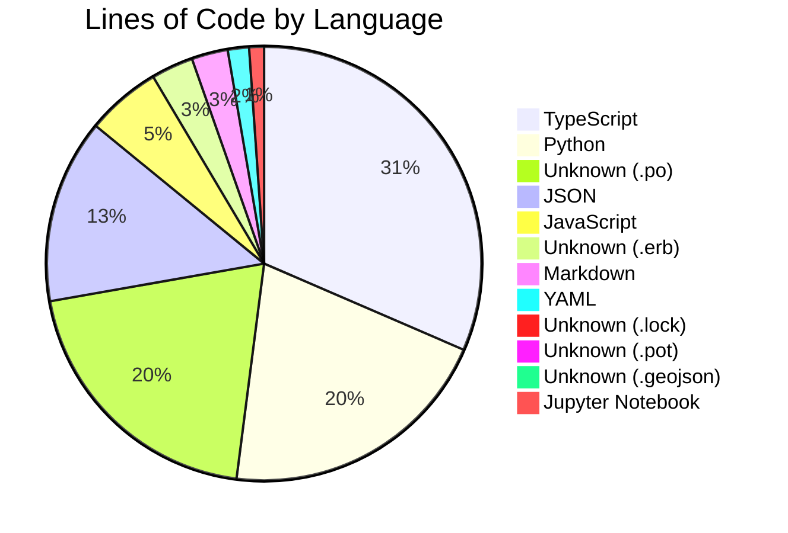
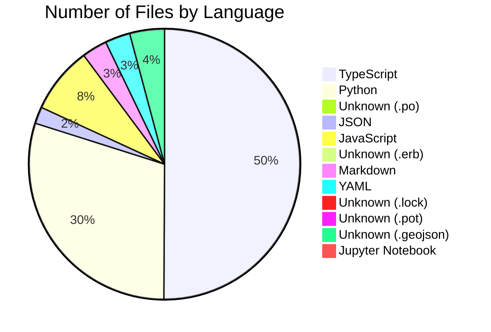
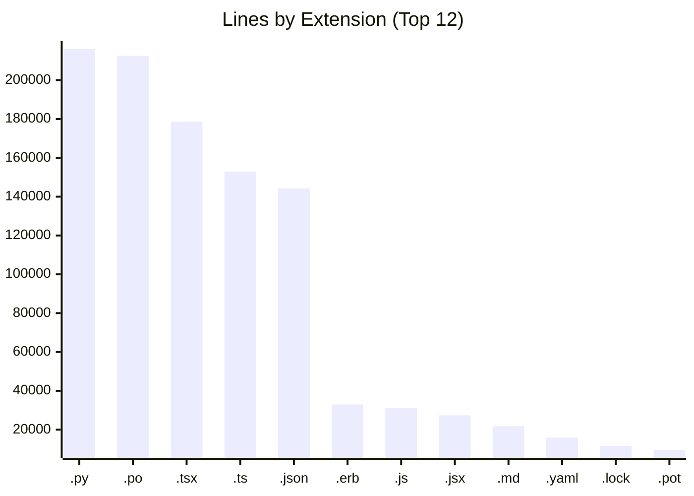
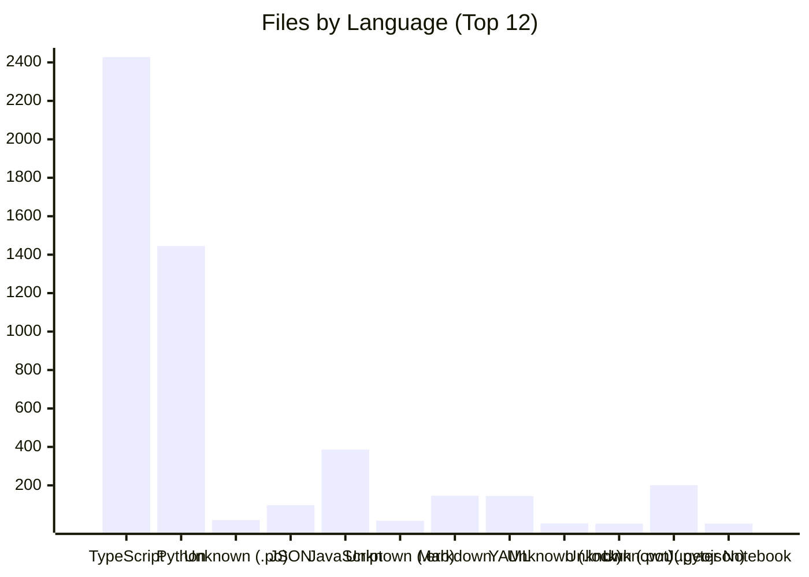

# 📊 Repository Analysis Report

**Generated:** 2026-04-08T14:46:58.575270+00:00  
**Root:** `/home/runner/work/central-dashboard/central-dashboard`

---
## 🗂️ Summary

| Metric | Value |
|--------|------:|
| Total Files | **5,720** |
| Total Lines (non-empty) | **1,085,356** |
| Unique Languages | **50** |
| Unique Extensions | **53** |

---
## 🧑‍💻 By Language

| Language | Files | % Files | Lines | % Lines |
|----------|------:|--------:|------:|--------:|
| TypeScript | 2,428 | 42.4% | 331,548 | 30.5% |
| Python | 1,445 | 25.3% | 216,047 | 19.9% |
| Unknown (.po) | 20 | 0.3% | 212,537 | 19.6% |
| JSON | 97 | 1.7% | 144,254 | 13.3% |
| JavaScript | 386 | 6.7% | 58,465 | 5.4% |
| Unknown (.erb) | 16 | 0.3% | 32,986 | 3.0% |
| Markdown | 146 | 2.6% | 28,371 | 2.6% |
| YAML | 145 | 2.5% | 16,642 | 1.5% |
| Unknown (.lock) | 2 | 0.0% | 11,627 | 1.1% |
| Unknown (.pot) | 1 | 0.0% | 9,452 | 0.9% |
| Unknown (.geojson) | 201 | 3.5% | 5,934 | 0.5% |
| Jupyter Notebook | 1 | 0.0% | 4,091 | 0.4% |
| Unknown (.svg) | 79 | 1.4% | 2,491 | 0.2% |
| LESS | 10 | 0.2% | 2,135 | 0.2% |
| HTML | 29 | 0.5% | 1,837 | 0.2% |
| Text | 11 | 0.2% | 1,697 | 0.2% |
| Shell | 34 | 0.6% | 1,614 | 0.1% |
| Dotfile/Config | 33 | 0.6% | 824 | 0.1% |
| Unknown (.puml) | 2 | 0.0% | 678 | 0.1% |
| TOML | 1 | 0.0% | 381 | 0.0% |
| Dockerfile | 3 | 0.1% | 271 | 0.0% |
| CSS | 5 | 0.1% | 218 | 0.0% |
| Unknown (.tpl) | 1 | 0.0% | 137 | 0.0% |
| Unknown (.j2) | 3 | 0.1% | 125 | 0.0% |
| Config | 2 | 0.0% | 110 | 0.0% |
| Makefile | 2 | 0.0% | 104 | 0.0% |
| Unknown (.template) | 2 | 0.0% | 97 | 0.0% |
| No Extension | 3 | 0.1% | 90 | 0.0% |
| Unknown (.in) | 4 | 0.1% | 81 | 0.0% |
| INI | 2 | 0.0% | 75 | 0.0% |
| Unknown (.pug) | 3 | 0.1% | 70 | 0.0% |
| Unknown (.from_local_tarball) | 1 | 0.0% | 57 | 0.0% |
| Unknown (.rdf) | 1 | 0.0% | 56 | 0.0% |
| Unknown (.from_svn_tarball) | 1 | 0.0% | 55 | 0.0% |
| Env Config | 1 | 0.0% | 43 | 0.0% |
| Unknown (.gotmpl) | 1 | 0.0% | 36 | 0.0% |
| Unknown (.mako) | 1 | 0.0% | 31 | 0.0% |
| Unknown (.make_docs) | 1 | 0.0% | 26 | 0.0% |
| Unknown (.example) | 1 | 0.0% | 25 | 0.0% |
| Unknown (.make_tarball) | 1 | 0.0% | 23 | 0.0% |
| Unknown (.snap) | 1 | 0.0% | 12 | 0.0% |
| Unknown (.csv) | 1 | 0.0% | 3 | 0.0% |
| Unknown (.gif) | 13 | 0.2% | 0 | 0.0% |
| Unknown (.png) | 489 | 8.5% | 0 | 0.0% |
| Unknown (.jpg) | 82 | 1.4% | 0 | 0.0% |
| Unknown (.woff) | 2 | 0.0% | 0 | 0.0% |
| Unknown (.woff2) | 2 | 0.0% | 0 | 0.0% |
| Unknown (.webp) | 1 | 0.0% | 0 | 0.0% |
| Unknown (.ico) | 1 | 0.0% | 0 | 0.0% |
| Unknown (.jpeg) | 2 | 0.0% | 0 | 0.0% |

### Lines of Code by Language — Pie (Top 12)

### Files by Language — Pie (Top 12)

---
## 🔖 By File Extension

| Extension | Files | % Files | Lines | % Lines |
|-----------|------:|--------:|------:|--------:|
| `.py` | 1,445 | 25.3% | 216,047 | 19.9% |
| `.po` | 20 | 0.3% | 212,537 | 19.6% |
| `.tsx` | 1,161 | 20.3% | 178,649 | 16.5% |
| `.ts` | 1,267 | 22.2% | 152,899 | 14.1% |
| `.json` | 97 | 1.7% | 144,254 | 13.3% |
| `.erb` | 16 | 0.3% | 32,986 | 3.0% |
| `.js` | 243 | 4.2% | 31,097 | 2.9% |
| `.jsx` | 143 | 2.5% | 27,368 | 2.5% |
| `.md` | 114 | 2.0% | 21,753 | 2.0% |
| `.yaml` | 138 | 2.4% | 15,930 | 1.5% |
| `.lock` | 2 | 0.0% | 11,627 | 1.1% |
| `.pot` | 1 | 0.0% | 9,452 | 0.9% |
| `.mdx` | 32 | 0.6% | 6,618 | 0.6% |
| `.geojson` | 201 | 3.5% | 5,934 | 0.5% |
| `.ipynb` | 1 | 0.0% | 4,091 | 0.4% |
| `.svg` | 79 | 1.4% | 2,491 | 0.2% |
| `.less` | 10 | 0.2% | 2,135 | 0.2% |
| `.html` | 29 | 0.5% | 1,837 | 0.2% |
| `.txt` | 11 | 0.2% | 1,697 | 0.2% |
| `.sh` | 34 | 0.6% | 1,614 | 0.1% |
| `(none)` | 40 | 0.7% | 1,262 | 0.1% |
| `.yml` | 7 | 0.1% | 712 | 0.1% |
| `.puml` | 2 | 0.0% | 678 | 0.1% |
| `.toml` | 1 | 0.0% | 381 | 0.0% |
| `.css` | 5 | 0.1% | 218 | 0.0% |
| `.tpl` | 1 | 0.0% | 137 | 0.0% |
| `.j2` | 3 | 0.1% | 125 | 0.0% |
| `.template` | 2 | 0.0% | 97 | 0.0% |
| `.in` | 4 | 0.1% | 81 | 0.0% |
| `.ini` | 2 | 0.0% | 75 | 0.0% |
| `.conf` | 1 | 0.0% | 75 | 0.0% |
| `.pug` | 3 | 0.1% | 70 | 0.0% |
| `.from_local_tarball` | 1 | 0.0% | 57 | 0.0% |
| `.rdf` | 1 | 0.0% | 56 | 0.0% |
| `.from_svn_tarball` | 1 | 0.0% | 55 | 0.0% |
| `.env` | 1 | 0.0% | 43 | 0.0% |
| `.gotmpl` | 1 | 0.0% | 36 | 0.0% |
| `.cfg` | 1 | 0.0% | 35 | 0.0% |
| `.mako` | 1 | 0.0% | 31 | 0.0% |
| `.dockerfile` | 1 | 0.0% | 27 | 0.0% |
| `.make_docs` | 1 | 0.0% | 26 | 0.0% |
| `.example` | 1 | 0.0% | 25 | 0.0% |
| `.make_tarball` | 1 | 0.0% | 23 | 0.0% |
| `.snap` | 1 | 0.0% | 12 | 0.0% |
| `.csv` | 1 | 0.0% | 3 | 0.0% |
| `.gif` | 13 | 0.2% | 0 | 0.0% |
| `.png` | 489 | 8.5% | 0 | 0.0% |
| `.jpg` | 82 | 1.4% | 0 | 0.0% |
| `.woff` | 2 | 0.0% | 0 | 0.0% |
| `.woff2` | 2 | 0.0% | 0 | 0.0% |
| `.webp` | 1 | 0.0% | 0 | 0.0% |
| `.ico` | 1 | 0.0% | 0 | 0.0% |
| `.jpeg` | 2 | 0.0% | 0 | 0.0% |

### Lines by Extension — Bar (Top 12)

### Files by Language — Bar (Top 12)

---
## 📚 References

- [GitHub Copilot Custom Agents](https://docs.github.com/en/copilot/how-tos/use-copilot-agents/cloud-agent/create-custom-agents)
- [Custom Agents Configuration Reference](https://docs.github.com/en/copilot/reference/custom-agents-configuration)
- [Org-level Custom Agents Setup](https://docs.github.com/en/copilot/how-tos/administer-copilot/manage-for-organization/prepare-for-custom-agents)